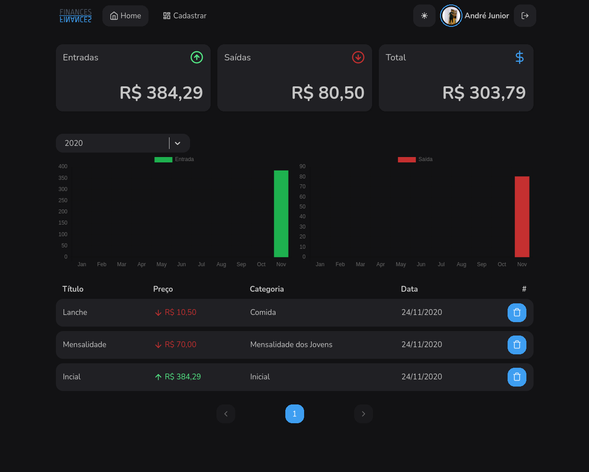
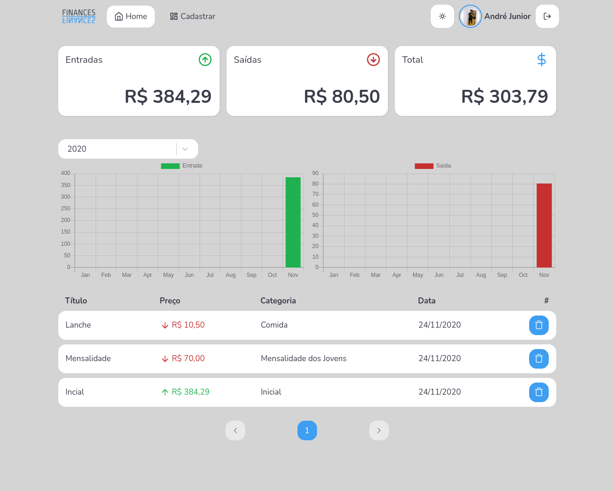
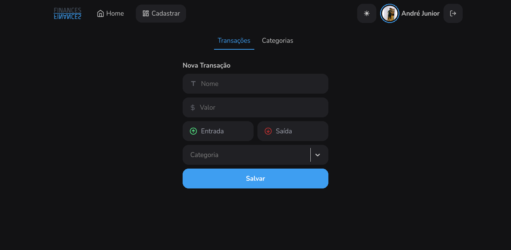

<h1 align="center">
    Finances
</h1>

<p align="center">
  <a href="#-tecnologias">Tecnologias</a>&nbsp;&nbsp;&nbsp;|&nbsp;&nbsp;&nbsp;
  <a href="#-projeto">Projeto</a>&nbsp;&nbsp;&nbsp;
</p>

<br>

<p align="center">
  
</p>

## 🚀 Tecnologias

Esse projeto foi desenvolvido com as seguintes tecnologias:

- [Adonis](https://adonisjs.com)

## 💻 Projeto

No bootcamp GoStack da Rockeseat, devenvolvemos uma aplicação GoFinances, e afim de aperfeiçoar o conhecimento adquirido, resolvi fazer um upgrade na aplicação, assim surgiu o Finances.

### Setup


Use o comando adonis para instalar

```bash
npm install
```

#### Migrations

Execute o seguinte comando para executar migrações de inicialização.

```js
adonis migration:run
```


Link para o [frontend](https://github.com/andrejr971/frontend-finances)


<p align="center">
  
</p>
<p align="center">
  
</p>

---

Feito by André Junior :wave: [portifólio](https://andrejr.dev)


